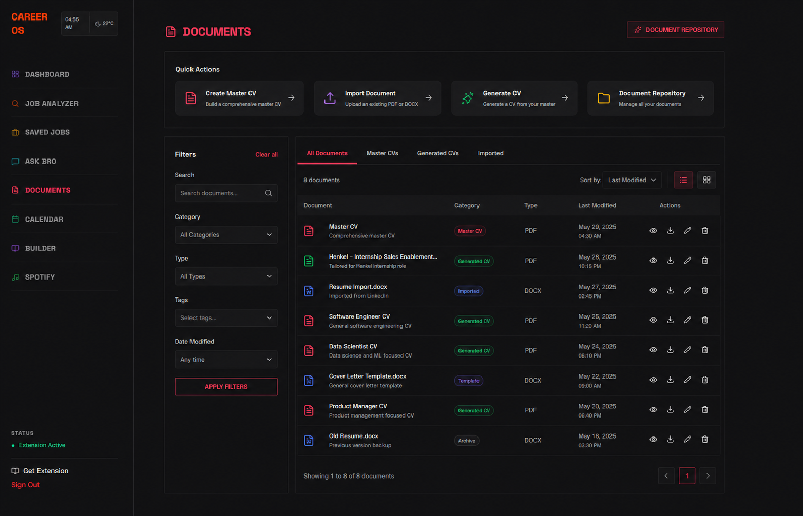
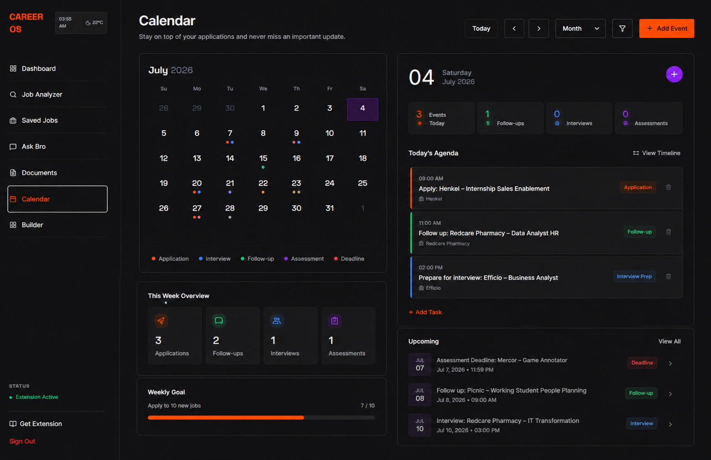

# Pivot

AI-powered career operations platform that automates job application workflows — from JD analysis to tailored document generation.

## Features

- **Job Description Analyzer** — Paste a URL or text to extract requirements, calculate ATS compatibility scores, and identify skill gaps
- **Multi-Resume Management** — Save multiple CV versions and compare them side-by-side against job requirements
- **Tailored Document Generation** — Generate ATS-optimized CVs and cover letters using Google Gemini AI
- **Application Tracker** — Track job applications with status management (Draft → Applied → Interview → Offer)
- **Dashboard** — Overview of application stats and recent activity
- **Document Management** — Store and manage generated documents
- **CV Builder** — Create and edit resumes with live preview
- **AI Chat Assistant** — Ask career-related questions
- **Calendar** — Track interviews and deadlines

## Screenshots

### Job Analyzer


### Saved Jobs


### CV Builder


### Documents


### Calendar


### AI Chat Assistant


## Tech Stack

- **Frontend:** React 19, TypeScript, Tailwind CSS
- **Backend:** Express.js
- **Database:** Firebase Firestore
- **AI:** Google Gemini API
- **PDF:** React PDF, jsPDF
- **Build:** Vite

## Setup

### Prerequisites

- Node.js 18+
- Google Gemini API key

### Install

```bash
npm install
```

### Configure

1. Copy `.env.example` to `.env`
2. Add your Gemini API key

```env
GEMINI_API_KEY=your-api-key
```

### Run

```bash
npm run dev
```

Open http://localhost:3000

## License

MIT
